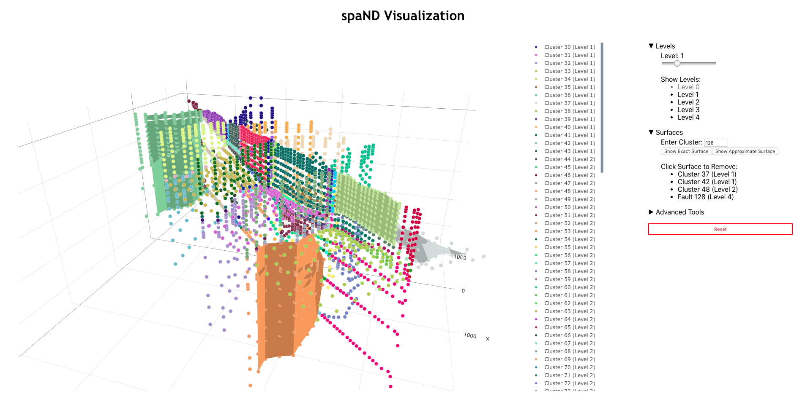

# spaND Visualization Tool

## Description

This visualization tool helps understand sparsified nested dissection when it is used in 3 dimensions.

***

## Table of Contents

1. [Setup Instructions](#setup-instructions)
2. [Adding Custom Data](#custom-data)
3. [Run Program with NPM](#run-npm)
4. [Run Program with Firebase](#run-firebase)
5. [Deploy Program to Firebase](#deploy-firebase)
6. [Other Available Scripts](#other)
7. [Contributors](#contributors)

***

## Setup Instructions

Dependencies:
* [React](https://github.com/facebook/react)
* [React-Plotly](https://github.com/plotly/react-plotly.js/)
* [Plotly](https://github.com/plotly/plotly.js/)
* [D3](https://github.com/d3/d3)
* [Delaunay-Triangulate](https://github.com/mikolalysenko/delaunay-triangulate)

In the project directory, run:

#### `npm install`
#### `npm install react react-plotly.js plotly.js d3 delaunay-triangulate`
#### `npm install -g firebase-tools`
#### `firebase login`

***

## Adding Custom Data _(optional)_

Go to _**public/data**_ and create a new folder.

Add the new data into the new folder. Remember, the following 4 files should be present:
* _clustering3d.csv_
* _coordinates.csv_
* _adjacency.csv_
* _clusters3d.txt_
* _merging3d.txt_
* _stats3d.txt_

After this is complete, open up _**src/App.js**_ and look for the variable _**folder**_.

Change the value of _**folder**_ to`data/<new_folder_name>`( e.g.`folder: data/newFolder`).

Run the program, and the new data will be used!

***

## Run Program with NPM

In the project directory, run:

#### `npm start`

Runs the app in the development mode. 
Open [http://localhost:3000](http://localhost:3000) to view it in the browser.

The page will reload if you make edits. 
You will also see any lint errors in the console.

***

## Run Program with Firebase

In the project directory, run:

#### `npm run build`
#### `firebase serve`

Runs the app in production mode. 
Open [http://localhost:5000](http://localhost:5000) to view it in the browser.

***

## Deploy Program to Firebase

In the project directory, run:

#### `npm run build`
#### `firebase deploy`

Deploys the app in production mode. 
Open [spand-vis.web.app](spand-vis.web.app) to view it in the browser

***

## Other Available Scripts

#### `npm test`

Launches the test runner in the interactive watch mode. 
See the section about [running tests](https://facebook.github.io/create-react-app/docs/running-tests) for more information.

#### `npm run build`

Builds the app for production to the `build` folder. 
It correctly bundles React in production mode and optimizes the build for the best performance.

The build is minified and the filenames include the hashes. 
Your app is ready to be deployed!

See the section about [deployment](https://facebook.github.io/create-react-app/docs/deployment) for more information.

#### `npm run eject`

**Note: this is a one-way operation. Once you `eject`, you can’t go back!**

If you aren’t satisfied with the build tool and configuration choices, you can `eject` at any time. This command will remove the single build dependency from your project.

Instead, it will copy all the configuration files and the transitive dependencies (Webpack, Babel, ESLint, etc) right into your project so you have full control over them. All of the commands except `eject` will still work, but they will point to the copied scripts so you can tweak them. At this point you’re on your own.

You don’t have to ever use `eject`. The curated feature set is suitable for small and middle deployments, and you shouldn’t feel obligated to use this feature. However we understand that this tool wouldn’t be useful if you couldn’t customize it when you are ready for it.

***

## Contributors
1. [Tanay Sonthalia](https://github.com/tsonthalia)
2. [Bazyli Klockiewicz](https://github.com/buzzlumberjack)

***

This project was bootstrapped with [Create React App](https://github.com/facebook/create-react-app").
<!--

## Learn More

You can learn more in the [Create React App documentation](https://facebook.github.io/create-react-app/docs/getting-started).

To learn React, check out the [React documentation](https://reactjs.org/).

### Code Splitting

This section has moved here: https://facebook.github.io/create-react-app/docs/code-splitting

### Analyzing the Bundle Size

This section has moved here: https://facebook.github.io/create-react-app/docs/analyzing-the-bundle-size

### Making a Progressive Web App

This section has moved here: https://facebook.github.io/create-react-app/docs/making-a-progressive-web-app

### Advanced Configuration

This section has moved here: https://facebook.github.io/create-react-app/docs/advanced-configuration

### Deployment

This section has moved here: https://facebook.github.io/create-react-app/docs/deployment

#### `npm run build` fails to minify

This section has moved here: https://facebook.github.io/create-react-app/docs/troubleshooting#npm-run-build-fails-to-minify

 

-->
